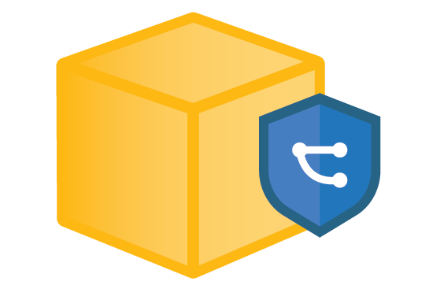

# **S2C2F Attestation Schema and Tool**

This project is initiated by the OpenSSF Supply Chain Integrity Working Group, S2C2F SIG, as part of the 2023 Microsoft Global Hackathon. The scope of this effort is to use [NIST OSCAL](https://pages.nist.gov/OSCAL/) as the machine-reable schema, and producing a GitHub compatible tool that analyzes a GitHub repo for meeting [Secure Supply Chain Consumption Framework (S2C2F)](https://github.com/ossf/s2c2f/tree/main) requirements and outputs the results in OSCAL format.

## 
**Motivation**

Building a tool that captures the security configuration of the development environment for a specific software project against a set of requirements (such as S2C2F) and outputs the results in machine-readable format (OSCAL) is the future of software transparency.

## 
**Objective**

This tool is being developed to provide a way to use Github Actions to assess a GitHub repo's implementation of S2C2F control requirements up to Maturity Level 2, and outputting the results in a machine-readable JSON file in OSCAL format. 

## 
**Scope**

1. Finalize S2C2F requirements for the project
2. Create an OSCAL format catalog model in JSON/XML
3. Validate the JSON/XML Model
4. Test tool on an Open Control Repo
5. Read JSON XML and perform gap analysis against the catalog model
5. Requirements for attestation are defined based on gap analysis

### 
**Quick Start**

*   Create Issues to track Feature requests
*   Pull requests are monitored in real time

## 
**Meeting times**

*   Meetings are in alignment with current S2C2F SIG Meeting times.

# 
**Governance**

The [CHARTER.md](https://github.com/ossf/S2C2F-attestation-schema-and-tool/blob/main/CHARTER.md) outlines the scope and governance of our group activities.

[OPTIONAL]
*   Adrian Diglio 
*   Jay White

#
**Intellectual Property**

In accordance with the [OpenSSF Charter (PDF)](https://charter.openssf.org/), work produced by this group is licensed as follows:

* MIT License available at https://opensource.org/licenses/MIT

**Antitrust Policy Notice**

Linux Foundation meetings involve participation by industry competitors, and it is the intention of the Linux Foundation to conduct all of its activities in accordance with applicable antitrust and competition laws. It is therefore extremely important that attendees adhere to meeting agendas, and be aware of, and not participate in, any activities that are prohibited under applicable US state, federal or foreign antitrust and competition laws.

Examples of types of actions that are prohibited at Linux Foundation meetings and in connection with Linux Foundation activities are described in the Linux Foundation Antitrust Policy available at http://www.linuxfoundation.org/antitrust-policy. If you have questions about these matters, please contact your company counsel, or if you are a member of the Linux Foundation, feel free to contact Andrew Updegrove of the firm of Gesmer Updegrove LLP, which provides legal counsel to the Linux Foundation.
