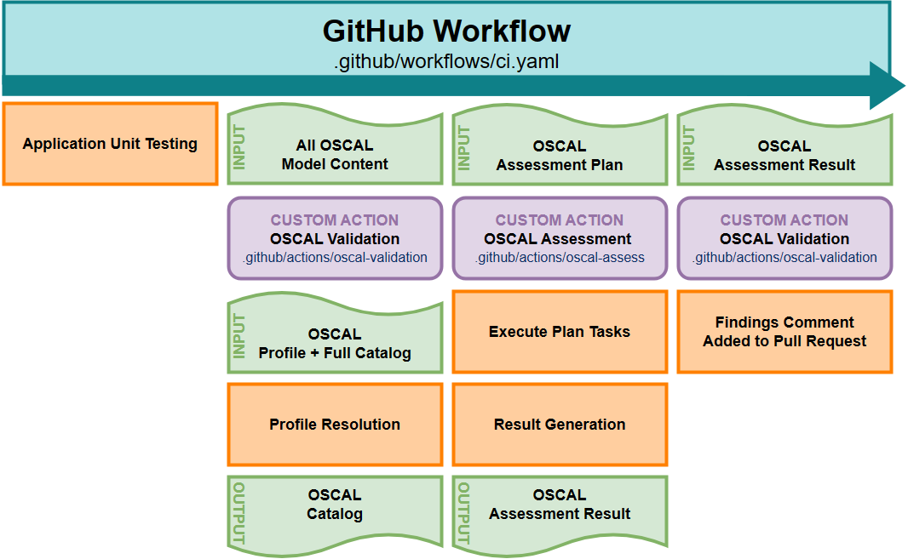

# S2C2F Attestation Schema and Tool Roadmap

Note: This graphic came from this Blossom case study [link](https://github.com/usnistgov/blossom-case-study/tree/main/docs) and largely represents how we wish to model our tool

- Finish S2C2F OSCAL catalog file validation
- Perform an OSCAL Assessment, which will produce a Component Definition file, which is the analysis of which S2C2F requirements the GitHub repo is compliant with
- Produce an OSCAL Assessment result that says "this system meets S2C2F Maturity Level 2 requirements"
